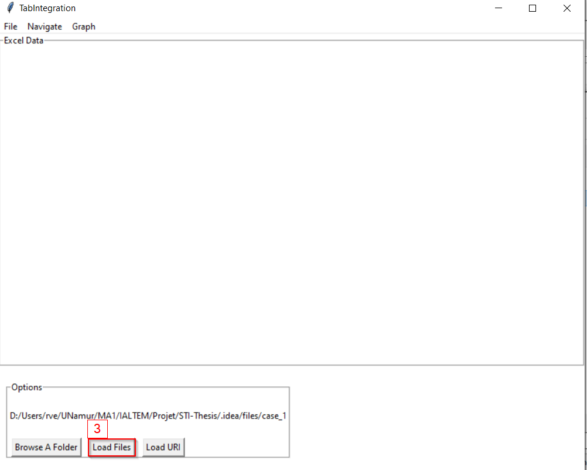
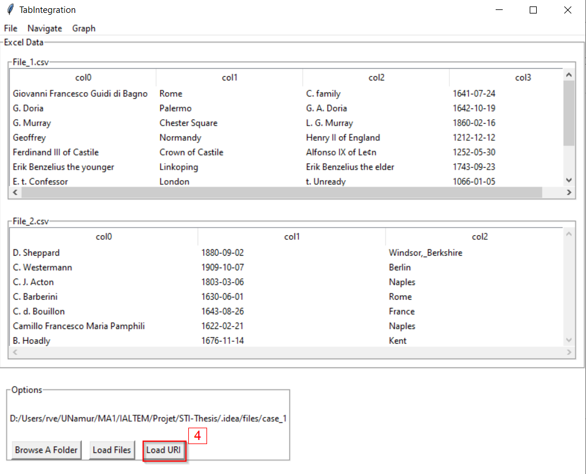
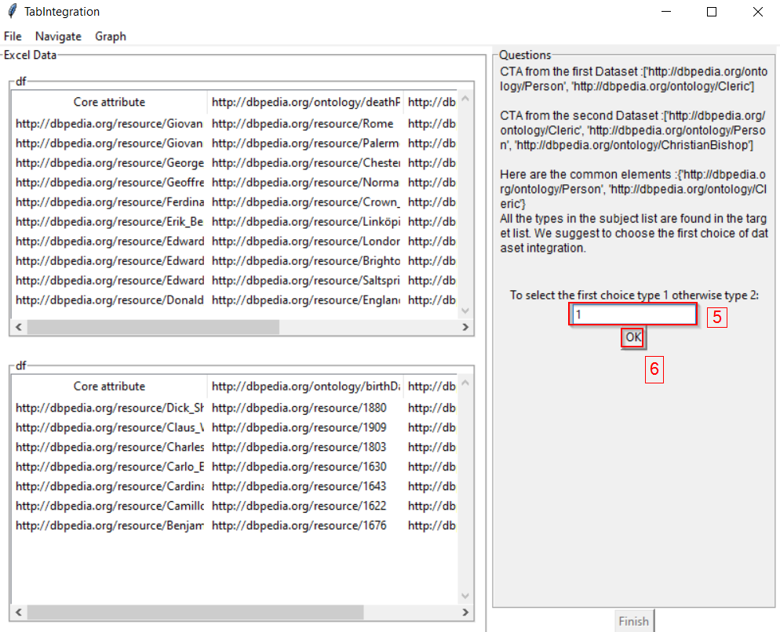
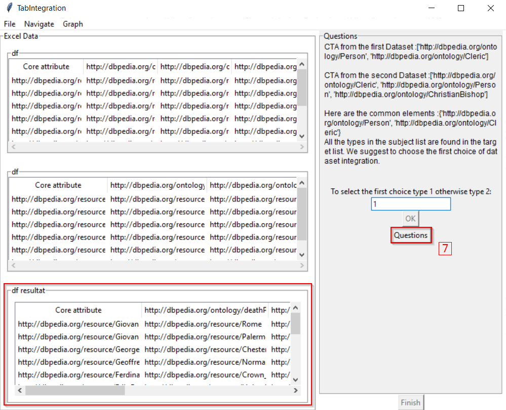
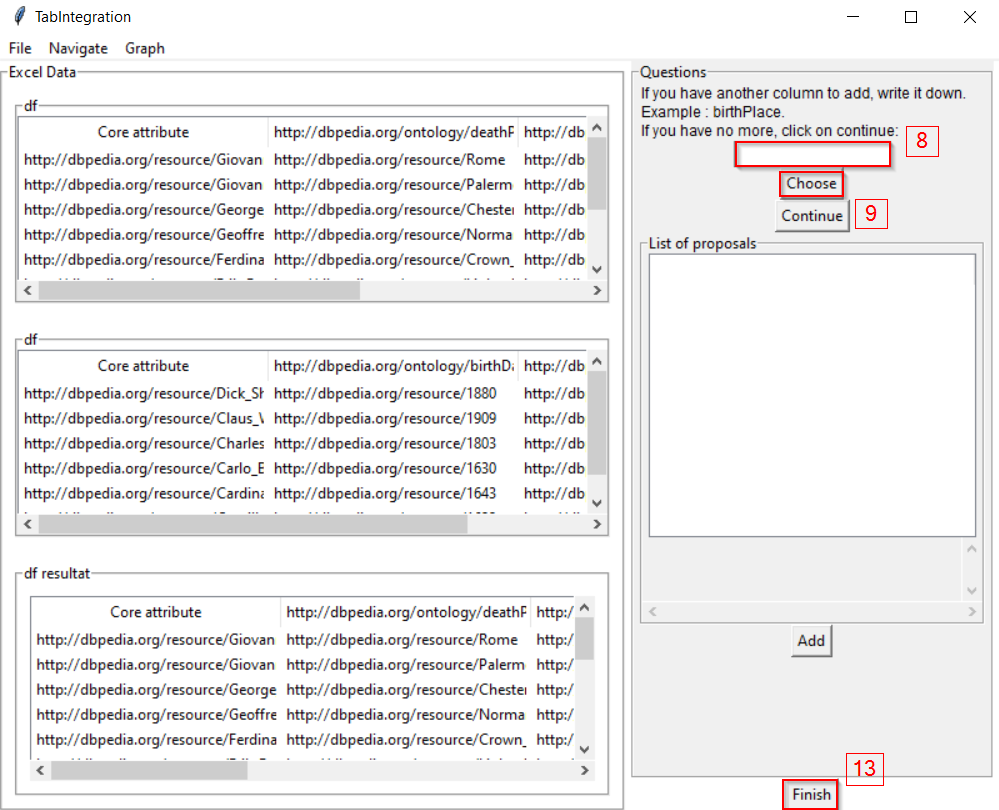
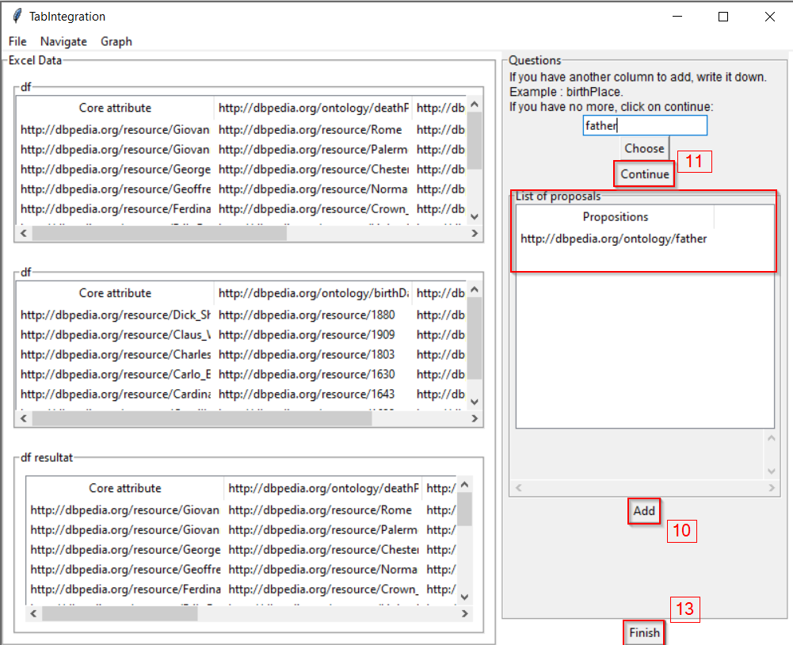
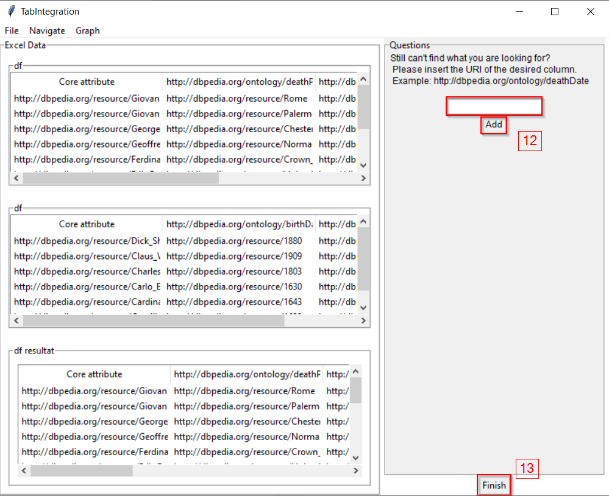
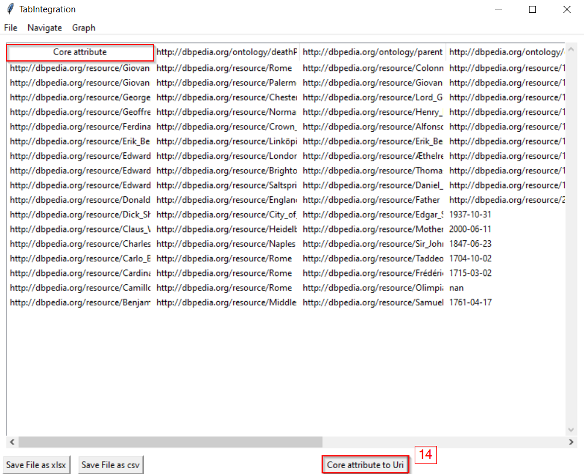
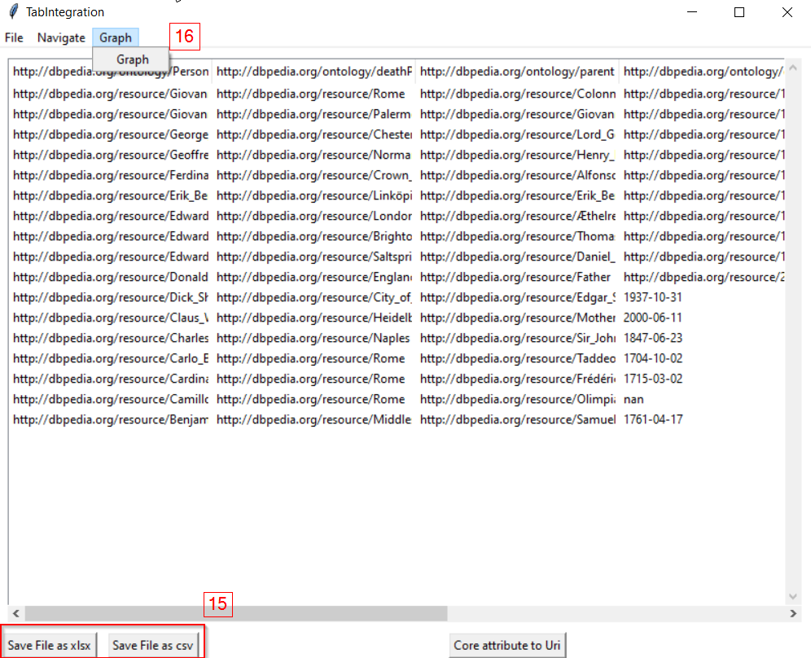

<h1>TabIntegration </h1>

<h2>Description </h2>

TODO 
TODO
 
 

 
<h2>Installation and Run</h2>

<h4> Requirements : </h4>
<ul>
    <li> <a href="https://www.python.org/">Python 3.9</a></li>
    <li> <a href="https://www.mozilla.org/firefox/download/">Firefox </a></li>
</ul>

<h4> Steps : </h4>
<ol>
    <li> Download zip of application of branch master </li>
    <li> Extract zip and launch cmd on its location </li>
    <li> Install all python librairies : </li>
    <pre>python sc_install.py </pre>
    <li> Launch application : </li>
    <pre>python main.py</pre>
</ol>

 
<h2>Demo</h2>

 You can find some files on .idea/files 

 Load Files 

 Load URI 

 Select your choice (1 or 2) 

 Show next question 

 Add one or more columns or finish if you want 

 Add one or more URIs or finish if you want 

 Click on core attribute to URI to change first column header 

 Now, you can display graph of results or save your results in file (csv or xlsx) 

 
<h2>Logs</h2>
